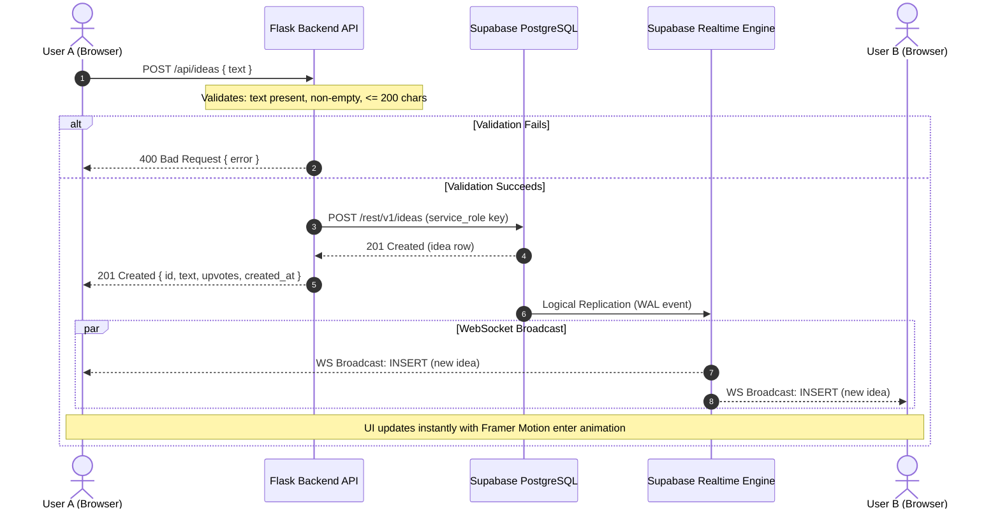
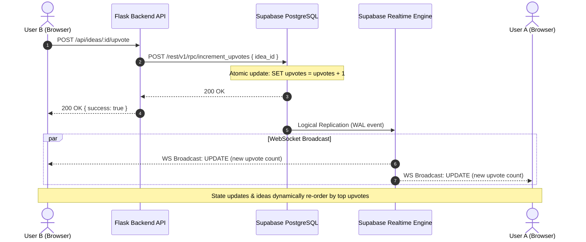
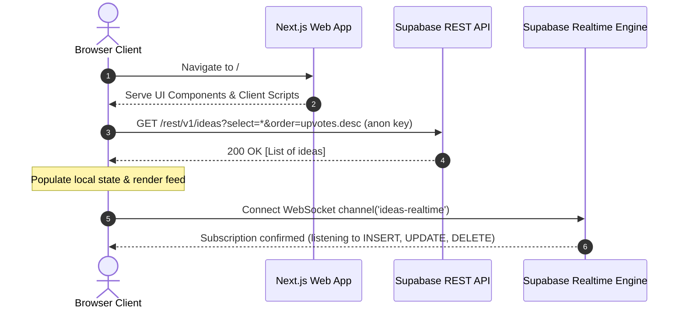
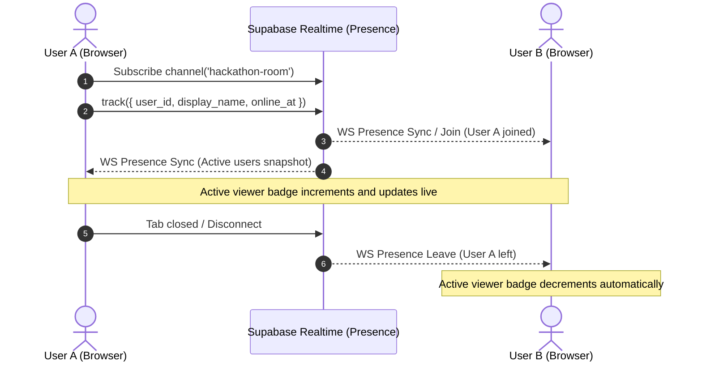

# Live Collaborative Idea Board

A real-time collaborative idea board built for virtual hackathon presentations. Audience members can submit ideas and questions, upvote them in real time, and see who else is currently viewing the board — all updating instantly across every connected browser.

**Live Demo**: [Idea Board — Live Collaborative Hackathon](https://fincorp-frontend-production.up.railway.app/)

    

---

## Architecture Overview

The application follows a **split responsibility** pattern where writes are validated server-side while reads leverage direct real-time connections:


### Data Flow Patterns

| Operation | Flow | Protocol |
|-----------|------|----------|
| **Create idea** | Browser → Flask (validate) → Supabase (insert) → Realtime → All browsers | HTTP + WebSocket |
| **Upvote idea** | Browser → Flask → Supabase RPC `increment_upvotes()` → Realtime → All browsers | HTTP + WebSocket |
| **Initial load** | Browser → Supabase REST API (fetch all ideas) | HTTP |
| **Live updates** | Supabase Realtime → Browser (INSERT/UPDATE/DELETE events) | WebSocket |
| **Presence** | Browser ↔ Supabase Presence channel (track/sync) | WebSocket |

### Why This Architecture?

- **Writes through Flask**: The assignment requires Flask to handle validation (text non-empty, ≤200 chars). The Flask backend uses the **service_role key** (full DB access) and never exposes it to the browser.
- **Reads from Supabase directly**: The assignment permits using Supabase's auto-generated API for reads. Direct WebSocket subscriptions give sub-100ms latency for live updates.
- **Atomic upvotes**: A PostgreSQL function (`increment_upvotes`) uses `SET upvotes = upvotes + 1` to prevent race conditions when multiple users upvote simultaneously.

---

## Sequence Diagrams

### 1. Idea Submission & Real-Time Broadcast Flow

This diagram illustrates how an audience member submits an idea through the Flask backend for validation, which persists to Supabase and triggers an instant WebSocket broadcast to all connected clients.



---

### 2. Atomic Upvote Flow & Real-Time Feed Re-sorting

This diagram demonstrates atomic upvoting preventing race conditions and the subsequent broadcast that triggers dynamic sorting across all clients.



---

### 3. Initial Page Load & Real-Time Subscription Flow

This diagram shows the initial bootstrap sequence when a user navigates to the application: direct read from Supabase REST API followed by WebSocket connection.



---

### 4. User Presence & Active Viewer Tracking

This diagram shows how users synchronize online presence and display names using Supabase Realtime Presence without hitting PostgreSQL.



---

## Database Schema

```sql
CREATE TABLE ideas (
    id          UUID          DEFAULT gen_random_uuid() PRIMARY KEY,
    text        TEXT          NOT NULL CHECK (char_length(text) <= 200),
    upvotes     INTEGER       DEFAULT 0,
    created_at  TIMESTAMPTZ   DEFAULT now()
);
```

Row Level Security is enabled with permissive policies (no auth per assignment requirements). Realtime broadcasting is enabled via PostgreSQL logical replication.

---

## Quick Start

### Prerequisites

- **Node.js** 18+ and npm
- **Python** 3.10+ and pip
- A free **[Supabase](https://supabase.com)** project

### 1. Database Setup

Open your Supabase project → **SQL Editor** → **New Query** → paste and run [`supabase/setup.sql`](supabase/setup.sql). This creates the table, RLS policies, realtime config, and upvote function.

### 2. Backend (Flask)

```bash
cd backend
python -m venv venv

# Activate virtual environment
# Windows:
venv\Scripts\activate
# macOS/Linux:
source venv/bin/activate

pip install -r requirements.txt
```

Configure environment variables in `backend/.env`:

```env
SUPABASE_URL=https://your-project-id.supabase.co
SUPABASE_SERVICE_KEY=your-service-role-key
FLASK_PORT=5000
```

Start the Flask server:

```bash
python app.py
# Idea Board API running on http://localhost:5000
```

### 3. Frontend (Next.js)

```bash
cd frontend
npm install
```

Configure environment variables in `frontend/.env.local`:

```env
NEXT_PUBLIC_SUPABASE_URL=https://your-project-id.supabase.co
NEXT_PUBLIC_SUPABASE_ANON_KEY=your-publishable-anon-key
NEXT_PUBLIC_FLASK_API_URL=http://localhost:5000
```

Start the development server:

```bash
npm run dev
# Next.js running on http://localhost:3000
```

### 4. Open & Test

1. Visit **http://localhost:3000** in two separate browser tabs
2. Submit an idea in one tab — watch it appear instantly in both
3. Upvote an idea — watch the count update and cards reorder in real time
4. Check the presence indicator — it shows both tabs as active viewers

---

## Features

### Core Requirements

| Feature | Status | Details |
|---------|--------|---------|
| Submit ideas via Flask | Complete | `POST /api/ideas` with validation |
| Input validation | Complete | Non-empty, ≤200 characters, whitespace trimming |
| Live feed | Complete | Supabase Realtime subscriptions (INSERT/UPDATE/DELETE) |
| Upvoting | Complete | Atomic increment via PostgreSQL function |
| Presence indicator | Complete | Shows active user count via Supabase Presence |

### Bonus Features

| Feature | Status | Details |
|---------|--------|---------|
| Display names | Complete | Stored in localStorage, visible in Presence tracker |
| Animations | Complete | Framer Motion: card enter/exit, upvote count flip, layout reordering |
| Real-time sorting | Complete | Ideas dynamically sort by most upvoted |

---

## Tech Stack

| Layer | Technology | Role |
|-------|-----------|------|
| Frontend | Next.js 16 + TypeScript | App Router, React components, SSR metadata |
| Styling | Tailwind CSS v4 | Dark mode design system, utility-first classes |
| Animations | Framer Motion | Spring physics, layout animations, AnimatePresence |
| Icons | Lucide React | Consistent, lightweight icon set |
| Backend | Flask (Python) | REST API, request validation, Supabase writes |
| Database | Supabase PostgreSQL | Data storage, RLS policies, atomic functions |
| Real-time | Supabase Realtime | WebSocket-based live data subscriptions |
| Presence | Supabase Presence | Active user tracking with metadata |

---

## API Endpoints (Flask)

### `POST /api/ideas` — Create Idea

**Request:**
```json
{ "text": "We should add dark mode to the dashboard" }
```

**Validation:**
- `text` is required and must be a string
- Cannot be empty or whitespace-only
- Maximum 200 characters

**Success Response (201):**
```json
{
    "id": "a1b2c3d4-...",
    "text": "We should add dark mode to the dashboard",
    "upvotes": 0,
    "created_at": "2026-09-24T18:30:00+00:00"
}
```

**Error Response (400):**
```json
{ "error": "Idea text must be 200 characters or less (currently 215 characters)" }
```

### `POST /api/ideas/:id/upvote` — Upvote Idea

**Request:** No body required.

**Success Response (200):**
```json
{ "success": true }
```

### `GET /api/health` — Health Check

**Response (200):**
```json
{ "status": "ok", "service": "idea-board-api" }
```

---

## Project Structure

```
├── backend/
│   ├── app.py                 # Flask API server (validation + Supabase writes)
│   ├── Dockerfile             # Python 3.13 + gunicorn production container
│   ├── .dockerignore
│   ├── requirements.txt       # Python deps: flask, flask-cors, requests, dotenv
│   ├── .env                   # SUPABASE_URL, SUPABASE_SERVICE_KEY (secret)
│   └── venv/                  # Python virtual environment (gitignored)
│
├── frontend/
│   ├── Dockerfile             # Multi-stage Node 20 build → standalone production
│   ├── .dockerignore
│   ├── src/
│   │   ├── app/
│   │   │   ├── layout.tsx     # Root layout: fonts, metadata, HTML shell
│   │   │   ├── page.tsx       # Main page: composes all components
│   │   │   └── globals.css    # Tailwind v4 dark theme, glassmorphism, animations
│   │   ├── components/
│   │   │   ├── IdeaForm.tsx          # Submit form with char counter
│   │   │   ├── IdeaCard.tsx          # Single idea: text, upvote btn, animations
│   │   │   ├── IdeaFeed.tsx          # Idea list with AnimatePresence
│   │   │   ├── PresenceIndicator.tsx # Online user count + names
│   │   │   └── DisplayNameEditor.tsx # Inline name editor
│   │   ├── hooks/
│   │   │   ├── useIdeas.ts    # Real-time ideas subscription + sorting
│   │   │   └── usePresence.ts # Presence channel tracking
│   │   └── lib/
│   │       ├── supabase.ts    # Supabase client initialization
│   │       ├── types.ts       # TypeScript interfaces (Idea, PresenceUser)
│   │       └── utils.ts       # cn(), timeAgo(), localStorage helpers
│   ├── .env.local             # Public Supabase URL/key, Flask API URL
│   ├── package.json
│   └── tsconfig.json
│
├── supabase/
│   └── setup.sql              # DB migration: table, RLS, realtime, functions
│
├── docker-compose.yml         # Run both services locally with one command
├── .env                       # Root env vars for docker-compose (gitignored)
├── .gitignore
└── README.md
```

---

## Security Notes

- The **service_role key** is only used server-side in Flask (never exposed to the browser)
- The **publishable/anon key** is used client-side and is safe because RLS policies restrict access
- User identity is a random UUID via `crypto.randomUUID()` stored in localStorage (per assignment spec — no auth)
- For production: add rate limiting, CAPTCHA, authentication, and scoped RLS policies

---

## Docker

Both services are containerized with multi-stage builds for production-optimized images.

### Run locally with Docker Compose

```bash
# Build and start both services
docker-compose up --build

# Frontend: http://localhost:3000
# Backend:  http://localhost:5000
```

Environment variables are loaded from the root `.env` file (not committed to git).

### Individual containers

```bash
# Backend only
docker build -t idea-board-api ./backend
docker run -p 5000:5000 --env-file ./backend/.env idea-board-api

# Frontend only (pass build args for NEXT_PUBLIC_* vars)
docker build -t idea-board-frontend ./frontend \
  --build-arg NEXT_PUBLIC_SUPABASE_URL=https://your-project.supabase.co \
  --build-arg NEXT_PUBLIC_SUPABASE_ANON_KEY=your-anon-key \
  --build-arg NEXT_PUBLIC_FLASK_API_URL=http://localhost:5000
docker run -p 3000:3000 idea-board-frontend
```

---

## Live Deployment

The application is deployed live on Railway:

- **Live Application**: [Idea Board — Live Collaborative Hackathon](https://fincorp-frontend-production.up.railway.app/)
- **Backend API**: `https://fincorp-backend-production.up.railway.app`

### Architecture on Railway


